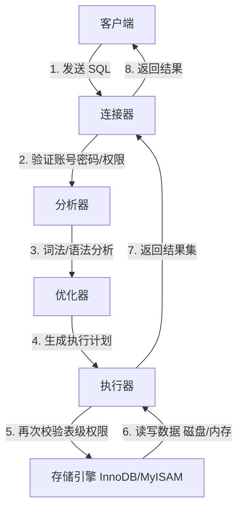

← [Ashe wiki](../../README.md)

---

## sql语句到MySQL的整体流程

理解这个流程对于 SQL 调优 至关重要：
- 连接慢？检查网络或连接池。
- 语法错？检查 SQL 写法。
- 执行慢但索引没走对？检查 优化器（统计信息是否准确，EXPLAIN 分析）。
- 执行慢且走了索引但还是慢？检查 存储引擎（磁盘 I/O、Buffer Pool 命中率、锁竞争）。
