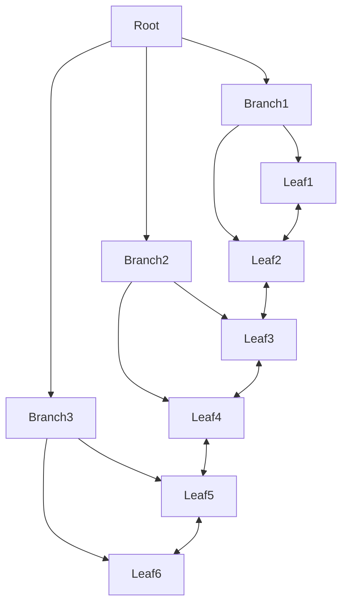

MySQL索引数据结构——B+树

数据都存放在叶子节点，腾出空间让分支节点可以组织更宽更矮的树结构，根据索引值查询时就会更快速。

| 结构特征 | 核心逻辑 | 性能收益 | 典型场景 (SQL) |
|:----------|:-----------|:------------|:----------------|
| 数据仅存叶子 | 分支节点仅存 Key，不存 Row Data，使树高度降低、扇出增大 | 降低磁盘 I/O 次数；亿级数据通常仅 3~4 层 | `WHERE id = 100` |
| 叶子双向链表 | 叶子节点按 Key 顺序通过双向指针连接 | 范围扫描无需回溯根节点，顺序 I/O 性能极高 | `WHERE id BETWEEN 10 AND 100` |
| 叶子有序排列 | 数据物理上按索引 Key 有序存储 | 可直接利用索引顺序完成排序，避免额外 Filesort | `ORDER BY id LIMIT 10` |