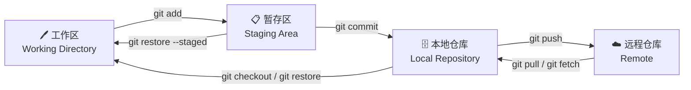
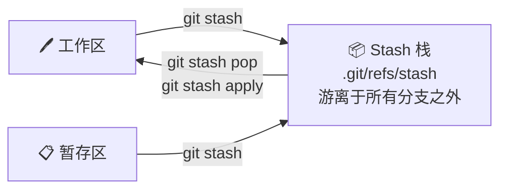
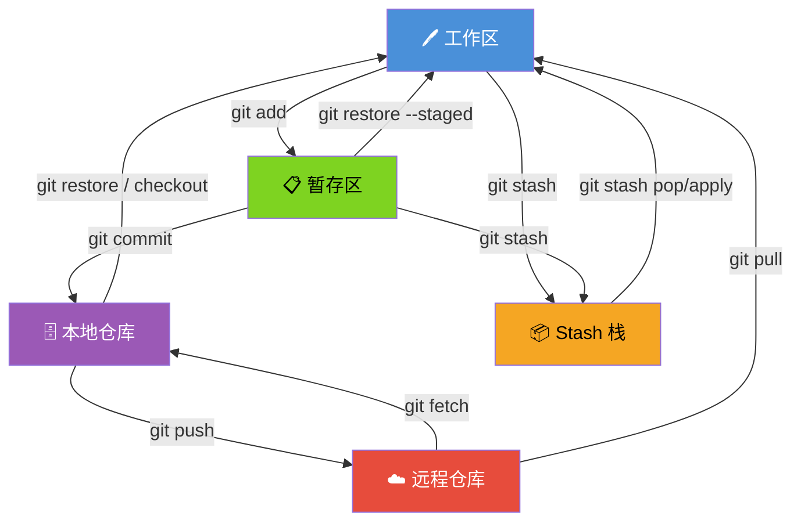

# Git 存储模型全解

## 一、三个核心区域

| 区域 | 别名 | 触发命令 | 存储位置 |
|------|------|----------|----------|
| 工作区 | Working Directory | 直接编辑文件 | 硬盘上的项目目录 |
| 暂存区 | Staging Area / Index | `git add` | `.git/index` |
| 本地仓库 | Local Repository | `git commit` | `.git/objects/` |

---

## 二、标准流程图



---

## 三、各区域详解

### 1. 工作区（Working Directory）

你在磁盘上直接看到、编辑的文件。

```bash
# 查看工作区与暂存区的差异
git diff

# 丢弃工作区的修改（危险！不可恢复）
git restore <file>
```

### 2. 暂存区（Staging Area）

`git add` 之后，改动进入暂存区，等待被 commit。

```bash
# 将文件加入暂存区
git add <file>
git add .               # 所有改动

# 查看暂存区与上次 commit 的差异
git diff --cached

# 将文件从暂存区撤回工作区（保留改动）
git restore --staged <file>
```

### 3. 本地仓库（Local Repository）

`git commit` 之后，改动生成一个不可变的 commit 对象。

```bash
# 提交
git commit -m "feat: 新增登录功能"

# 修改最近一次 commit（未 push 前）
git commit --amend

# 回退到某个 commit，保留改动在工作区
git reset --soft HEAD~1

# 回退到某个 commit，保留改动在工作区（不保留暂存）
git reset --mixed HEAD~1   # 默认行为

# 回退到某个 commit，丢弃所有改动（危险！）
git reset --hard HEAD~1
```

---

## 四、git status 看懂三个区域

```bash
git status
```

```
On branch main

Changes to be committed:       ← 暂存区（已 git add，待 commit）
  modified:   src/app.py

Changes not staged for commit: ← 工作区（已修改，未 git add）
  modified:   README.md

Untracked files:               ← 工作区（新文件，从未 git add）
  temp.log
```

---

## 五、特殊情况：git stash

### 是什么？

`git stash` 将**工作区 + 暂存区**的改动临时打包成一个游离的 commit，
塞入本地 `.git/` 中一个独立的栈结构，**不属于任何分支**。

### stash 流程图



### stash 存储位置

```
.git/
├── refs/stash        ← 指向最新一条 stash
├── logs/refs/stash   ← 所有 stash 的历史记录
└── objects/          ← stash 的实际内容（commit 对象）
```

### 注意事项

| 特性 | 说明 |
|------|------|
| 是否属于分支 | ❌ 不属于任何分支 |
| git push 会带走吗 | ❌ 不会，仅存本地 |
| 默认包含 untracked 文件吗 | ❌ 不包含 |
| 数据结构 | 栈（后进先出） |

### 常用命令

```bash
git stash                  # 存储工作区+暂存区改动
git stash -u               # 同上，额外包含 untracked 文件
git stash -a               # 同上，额外包含 .gitignore 的文件

git stash list             # 查看所有 stash
# stash@{0}: WIP on main: abc1234 上次的提交信息
# stash@{1}: WIP on dev:  def5678 ...

git stash pop              # 取出最新一条（取出后从栈中删除）
git stash apply stash@{1} # 取出指定一条（保留在栈中）
git stash drop stash@{0}  # 删除指定一条
git stash clear            # 清空所有 stash
```

---

## 六、完整区域总览



---

## 七、速查记忆卡

```
改了文件  →  工作区   (git diff)
git add   →  暂存区   (git diff --cached)
git commit →  本地仓库 (git log)
git push  →  远程仓库

git stash →  游离的临时栈（不属于任何分支，push 带不走！）
```
