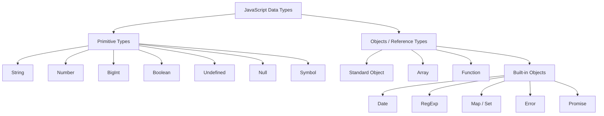

## print

```hello.js
console.log("Hello, World!");
console.error("Something went wrong");
console.warn("Warning");
console.info("Information");
```

node hello.js


## variables
```
const name = "Ashe";
let age = 20;

age = 21;
```
## types

```
const name = "Charles";       // string
const age = 20;               // number
const online = true;          // boolean
const value = undefined;      // undefined
const empty = null;           // null

const user = { name: "Charles" }; // object
const numbers = [1, 2, 3];        // array
```



## functions

## arrays

## objects