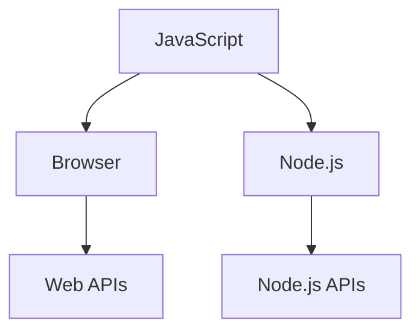

JavaScript is a programming language.

A JavaScript engine executes JavaScript. A runtime environment combines the engine with additional APIs and capabilities. Browser and Node.js are two different JavaScript runtime environments.

