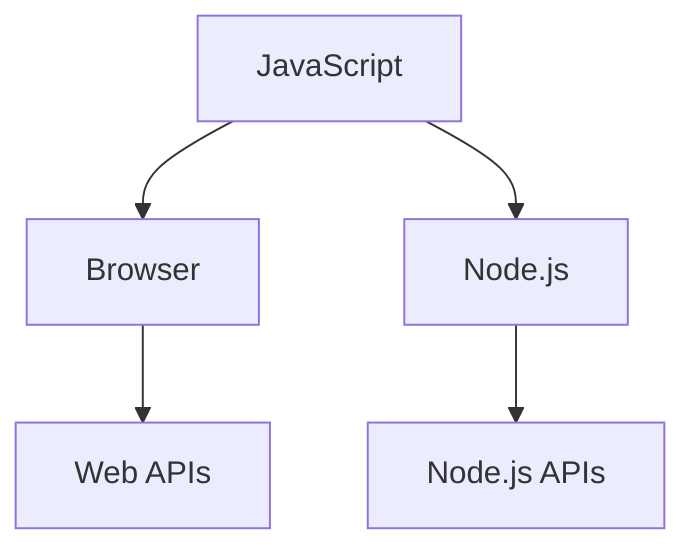

# Markdown常用语法

## 1. 标题 (Headings)
```bash
# 一级标题
## 二级标题
### 三级标题
#### 四级标题
##### 五级标题
###### 六级标题
```

## 2. 文本强调 (Emphasis)
```bash
**粗体文本** 或 __粗体文本__
*斜体文本* 或 _斜体文本_
***粗斜体文本***
~~删除线文本~~
```


## 3. 列表 (Lists)
```bash
无序列表
- 项目 1
- 项目 2
  - 子项目 2.1 (缩进两个空格或一个Tab)
  - 子项目 2.2

有序列表
1. 第一步
2. 第二步
3. 第三步

任务列表 (Task Lists)
- [x] 已完成的任务
- [ ] 未完成的任务
```

## 4. 引用 (Blockquotes)
```bash
> 这是一段引用文本。
> > 这是嵌套引用。
```

## 5. 代码 (Code)
```bash
行内代码
请使用 `print("Hello")` 函数。

代码块
三个反引号 ``` 包裹
```

## 6. 链接与图片 (Links & Images)
```bash
[显示文本](https://www.example.com)

```

## 7. 表格 (Tables)
```bash
| 表头 1 | 表头 2 | 表头 3 |
| :---   | :---:  | ---:   |
| 左对齐 | 居中对齐 | 右对齐 |
| 内容 A | 内容 B  | 内容 C  |
```

## 8. 分割线 (Horizontal Rules)
```bash
---
***
___
```

## 9. 转义字符 (Escaping)
```bash
\# 这不是标题
\* 这不是列表
```

## 10. 脚注 (Footnotes)
```bash
这是一个句子[^1]。

[^1]: 这是脚注的内容。
```

## 11. 注释（Comment）

```bash
<!--
## 这个标题暂时隐藏

一大段说明...
-->
```

## 12. Mermaid diagram

```
```mermaid
graph TD
this is mermaid graph content
\```
```


