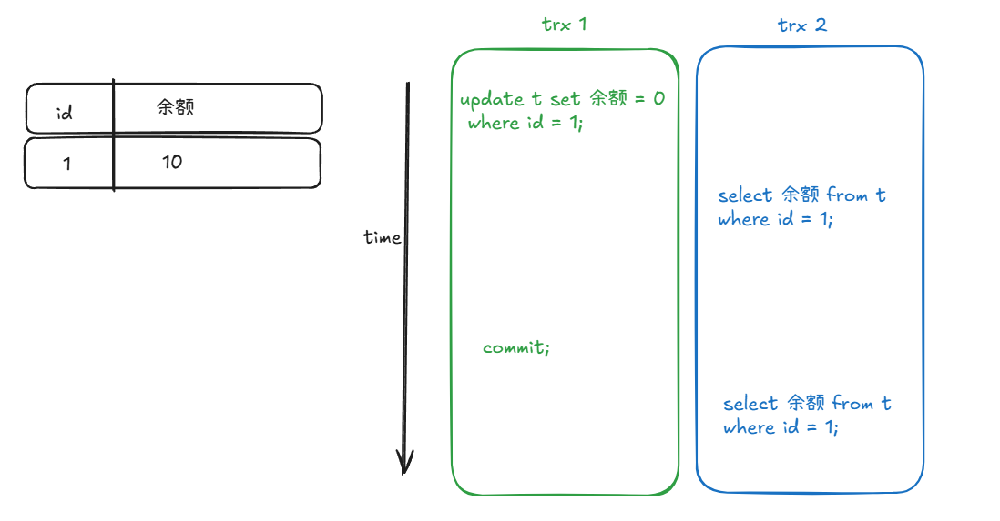

← [Ashe wiki](../README.md)

---

多版本并发控制(Multiversion Concurrency Control)
是一种通过维护数据多个版本来消除读写冲突的技术。

在传统的双锁协议（Two-Phase Locking，简称 2PL）下，当某一行数据在进行写操作的时候，并发的读操作就会发生阻塞，也就是读写冲突，mvcc就是为了解决这个问题而推出的方案。（在读多写少的场景下，MVCC 能极大地提高并发性能，因为没有大量的锁等待和死锁问题。）

如上图所示，两个并发的事务发生时。在读已提交（read commited）的事务隔离机制下，事务2的两次查询结果分别为10、0。  
在重复读（repeated read）的事务隔离机制下，事务2的两次查询结果都是10。
