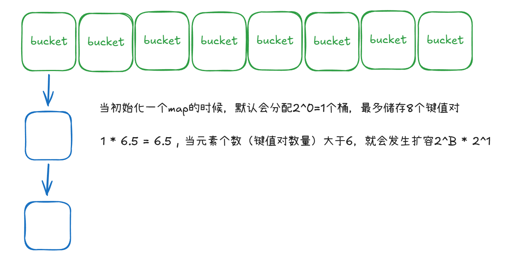

← [Ashe wiki](../README.md)

---


> 当初始化一个map的时候，Go 会延迟分配，直到你写入第一个元素（key-value）时，才会真正创建这 1 个 bucket（B=0），最多储存8个元素。1*6.5=6.5，当第7个元素(key-value)写入时，就会发生第一次扩容2^B * 2^1 = 2个bucket

## 1. 存储结构与定位
- 桶（bucket）数组
- 哈希计算：`h1 = hash(key1)`
- 索引计算：`index = h1 & (2^B - 1) // 使用位运算加速取模等价于 h1 % 2^B，但性能更高`

## 2. 哈希冲突/索引重合
- 拉链法
  - 单个桶最多存8个键值对。
  - 如果一个 bucket 满了，会链表连接一个溢出桶。

## 3. 扩容机制
### 增量扩容
- 触发条件：写入数据时判断负载因子是否过高（超过 **6.5**）。
- 过程：创建一个新的 `buckets` 并逐步迁移数据。
- 目的：**渐进式扩容**，避免一次性迁移导致 STW (Stop The World) 时间过长。

### 等量扩容
- 触发条件：负载因子不高，但**溢出桶过多**（当 B ≤ 15 时,如果 溢出桶的总数 ≥ 正常桶的总数，触发。 当 B ≥ 15 时，如果 溢出桶的总数 ≥ 2^15，触发）。
- 目的：解决内存碎片化问题。

## 4. 核心公式
负载因子 (LoadFactor)：
```text
loadfactor = count（键值对数量） / 2^B（桶数量）
```

[简单使用代码](https://github.com/ashe-c0de/lang-lab/blob/main/golang/map/map.go)
